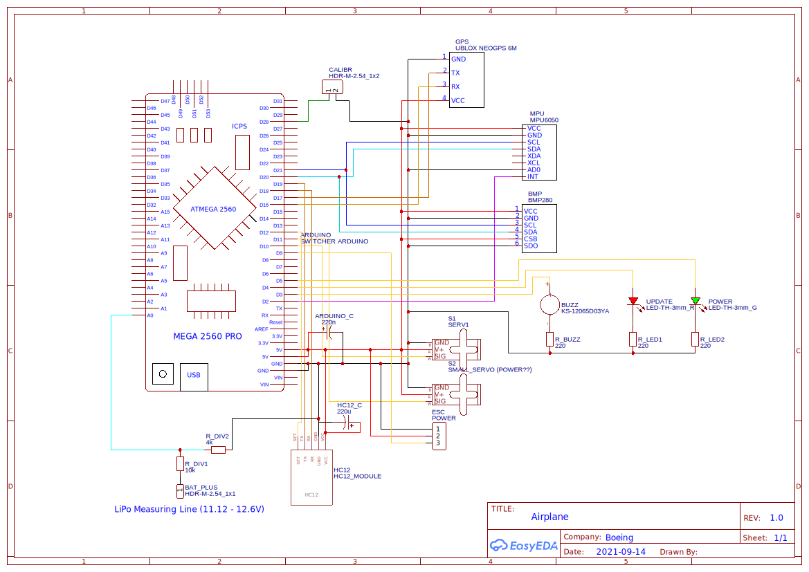

# PCB Test Mimicking (CojAir)

This repository contains the code for mimicking an airplane and its controller.

## Submodules
**Airplane**: Contains the code mimicking the airplane. It uses the HC-12 to send its telemetry to the base station (controller).
**Controller**: Contains the code mimicking the base station (controller). It uses the HC-12 to receive and parse the telemetry from the airplane.

All communication

## Hardware used

- 1x Arduino ATMega2560
- 1x HC12 Wireless Module transceiver
- 1x MPU6050 Accelerometer
- 1x 10K Ohm Resistor
- 1x 4k Ohm Resistor
- 3x 220 Ohm Resistors
- 1 220uF Capacitor
- 1x 220nF Capacitor
- 1x Buzzer
- 1x Red LED
- 1x Green LED
- 2x Servo Motors
- 1x Custom printed PCB
- 1x BMP 280

## Schematics and Designs

### Schematic for PCB
Here is a picture of the airplane, the controller used a generic breadboard setup with a HC-12 transceiver module.

[EasyEDA JSON file for Schematic](assets/schematic.json)

### PCB Design

[EasyEDA JSON file for PCB](assets/pcb.json)
